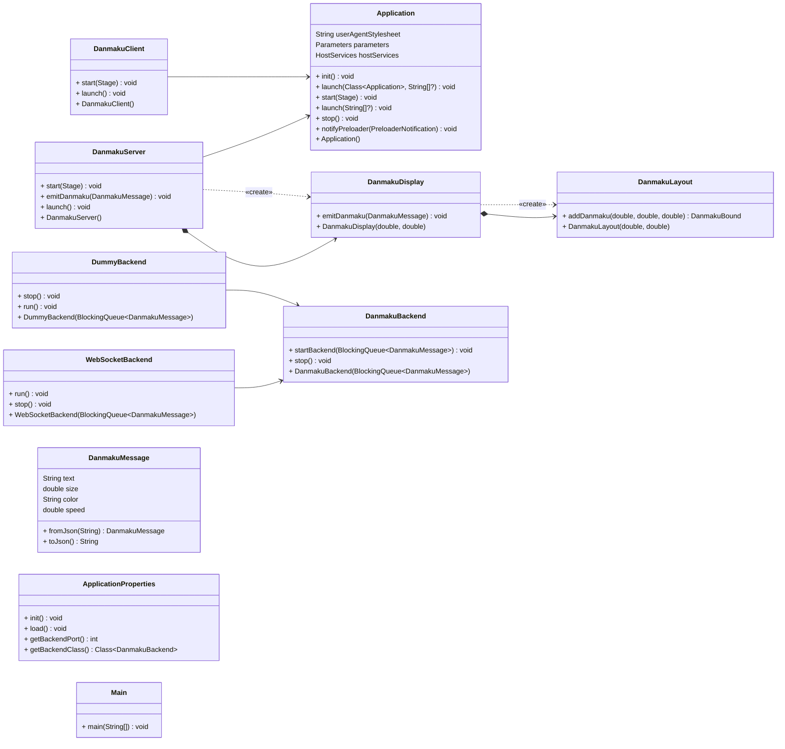

# DanmakuFX

## 简介

DanmakuFX 是一个基于 JavaFX 的桌面弹幕显示组件，可以用于晚会、直播等场景，在屏幕上显示弹幕。

## 结构

- `src/main/java`：源代码
  - `cc.wybxc.Main`：程序入口
  - `cc.wybxc.frontend`：展示前端
    - `DanmakuClient`：弹幕客户端（发送弹幕）
    - `DanmakuServer`：弹幕服务器（接收与显示弹幕）
  - `cc.wybxc.backend`：后端
    - `DanmakuBackend`：弹幕后端基类（接收弹幕）
    - `DummyBackend`：测试用后端
    - `WebSocketBackend`：WebSocket 后端
  - `cc.wybxc.common`：通用类
    - `DanmakuMessage`：弹幕消息类
    - `ApplicationProperties`：应用程序配置类
- `WebSocketClientExample.html`：WebSocket 客户端页面（测试用）

## 依赖

- 平台
  - Java 17
- 图形界面
  - JavaFX 19
  - FXTrayIcon 4.0
- 网络后端
  - Java-WebSocket 1.5
  - Jackson 2.13
- 基础库与开发工具
  - slf4j 2.0
  - Apache Commons CLI 1.5
  - Lombok 1.18

## 构建

项目采用 maven 进行依赖和构建管理，使用 `maven-assembler-plugin` 插件进行打包。

```shell
mvn clean package
```

## 运行

```shell
java -jar target/DanmakuFX-1.0-SNAPSHOT-jar-with-dependencies.jar
```

## 使用

直接运行程序，默认以服务端模式运行，在本机 2333 端口上开启 WebSocket 服务，监听弹幕消息。

### 命令行参数

```text
usage: DanmakuFX
 -b,--backend <arg>   Backend class (default:
                      cc.wybxc.backend.WebSocketBackend)
 -c,--client          Run as client instead of server
 -d,--debug           Enable debug mode
 -h,--help            Print this message
 -p,--port <arg>      Port to listen on (default: 2333)
```

### 服务端模式

此模式下，程序会监听本机指定端口上的 WebSocket 连接，接收弹幕消息并显示。

其他客户端连接到 WebSocket 后，以 JSON 格式发送弹幕消息，格式如下：

```json
{
  "text": "弹幕内容",
  "size": 24,
  "color": "#FFFFFF",
  "speed": 144
}
```

收到的弹幕消息会在屏幕上显示，从右向左滚动。

### 客户端模式

此模式下，程序会连接到指定的 WebSocket 服务器，发送弹幕消息。

可以客户端的图形界面输入弹幕内容，指定字体大小、颜色和速度，点击发送按钮发送弹幕。

出于测试目的，客户端还提供了一次性重复发送多条弹幕的功能。

## UML 类图



## 特色功能

- 基于 JavaFX 动画，支持多种字体、颜色、速度的弹幕
- 通过反射机制，动态加载不同的弹幕后端，理论上支持外挂 jar 包加载自定义后端
- 通过 WebSocket 通信，支持跨平台、跨语言的弹幕发送

## 计划中的功能

- [ ] 支持更多弹幕类型（顶部、底部、逆向等）
- [ ] 支持自定义动画弹幕（高级弹幕）
- [ ] 优化图形性能
- [ ] 优化弹幕布局算法
